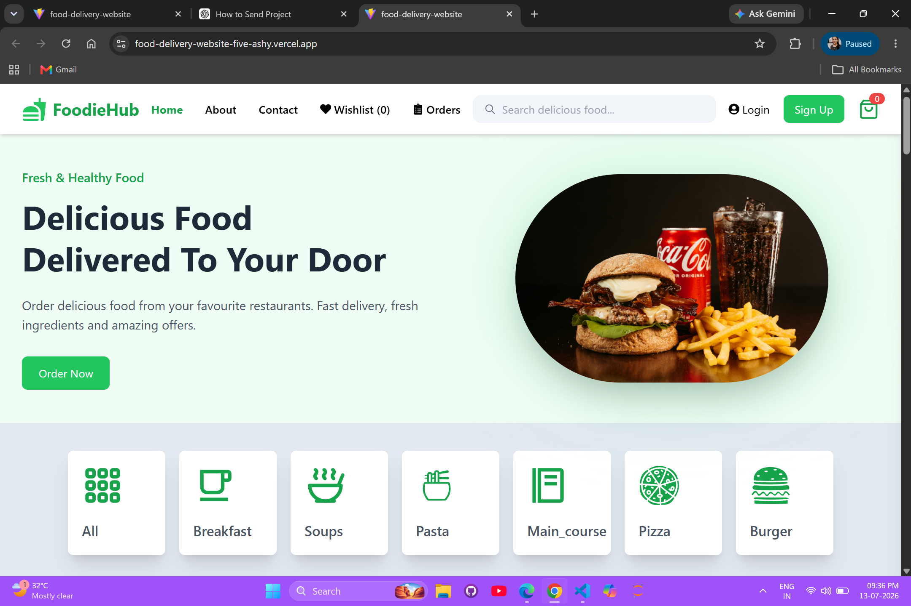
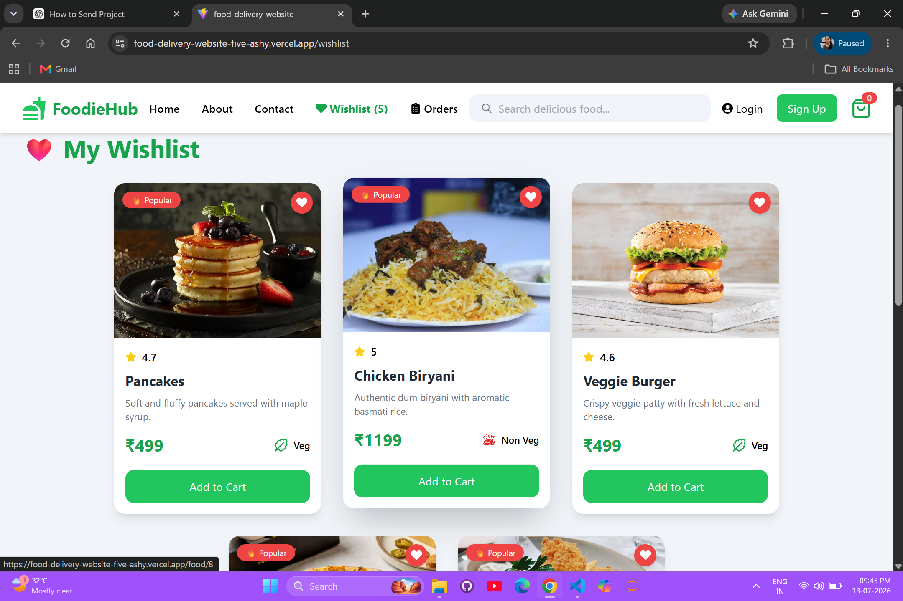
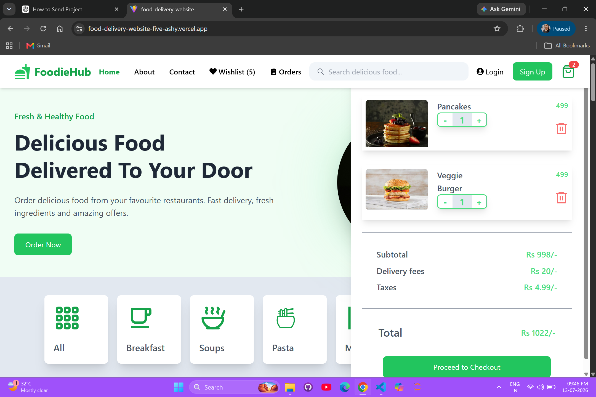
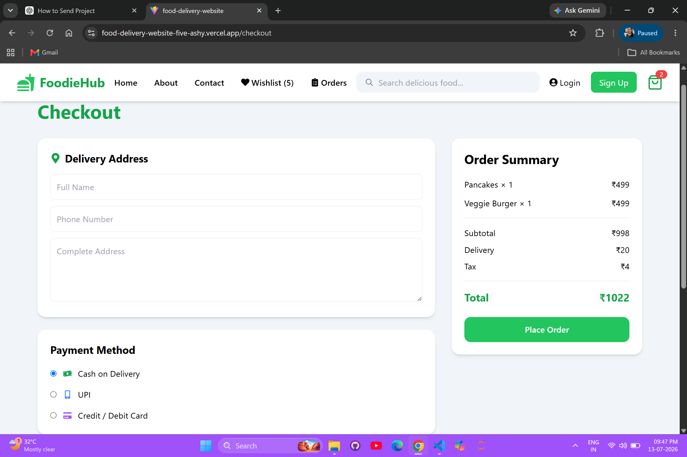
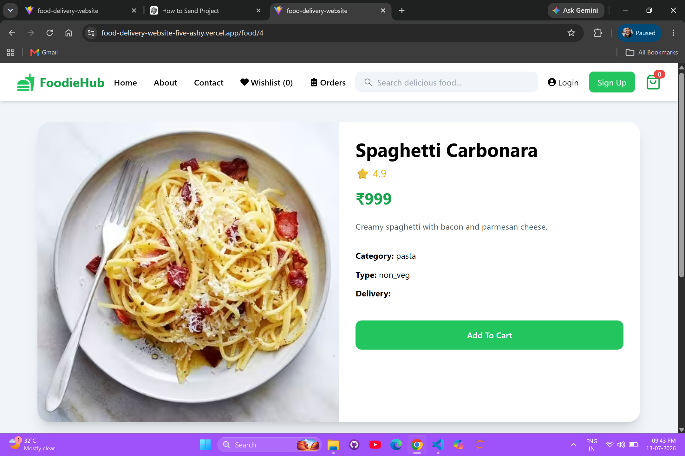
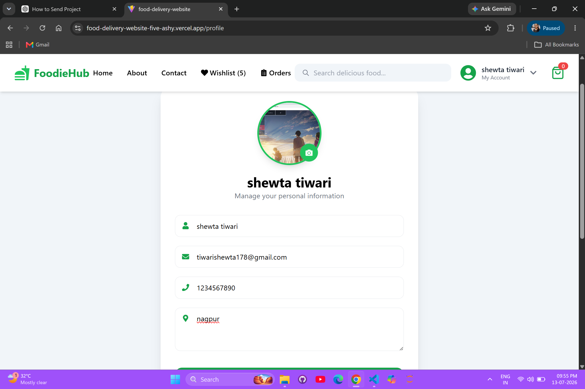
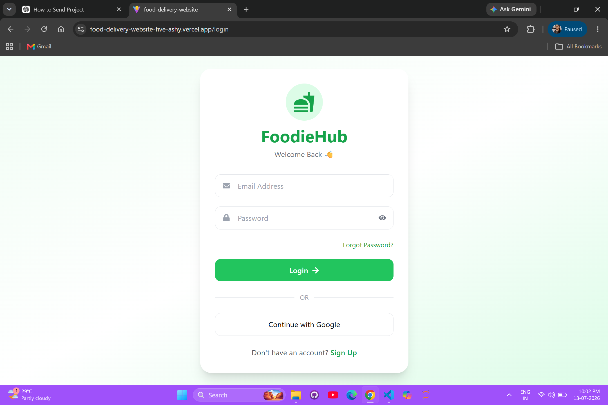
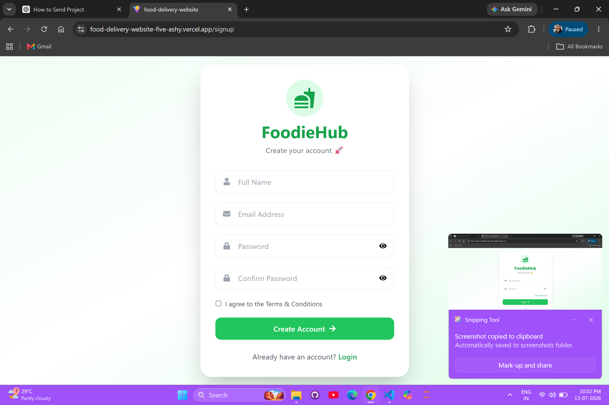
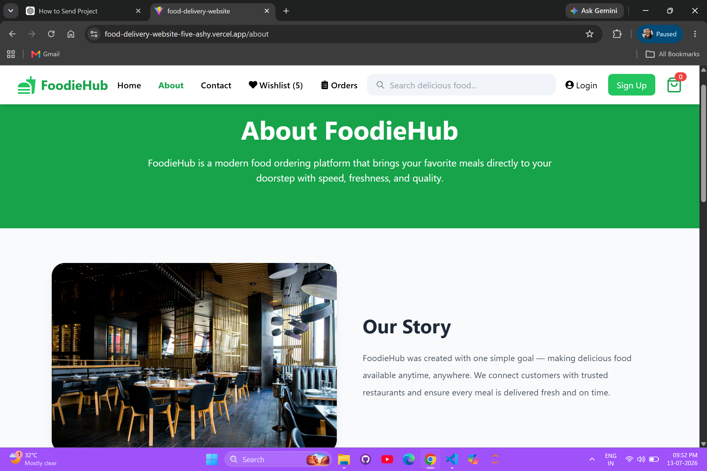

# 🍔 FoodieHub - Food Delivery Website

A modern and responsive Food Delivery Web Application built using **React.js**, **Redux Toolkit**, and **Tailwind CSS**. Users can browse food items, search dishes, manage cart and wishlist, place orders, and authenticate using Login/Signup.

## 🚀 Live Demo

🔗 https://food-delivery-website-five-ashy.vercel.app/

## 💻 GitHub Repository

🔗 https://github.com/Jayshrifulzele/Food-Delivery-Website

---

## ✨ Features

- 🏠 Modern Home Page
- 🔍 Search Food Items
- 🍕 Category Filter
- ❤️ Wishlist
- 🛒 Shopping Cart
- 💳 Checkout Page
- 📦 Orders Page
- 👤 User Profile
- 🔐 Login & Signup Authentication
- 📱 Responsive Design
- ⚡ Fast Performance

---

## 🛠️ Tech Stack

- React.js
- Redux Toolkit
- React Router DOM
- Tailwind CSS
- React Icons
- React Toastify
- Vite

---

## 📸 Screenshots

### 🏠 Home Page



---

### ❤️ Wishlist



---

### 🛒 Shopping Cart



---

### 💳 Checkout



---

### 🍔 Food Details



---

### 👤 Profile



---

### 🔐 Login / Logout

#### Login



---

### 📝 Signup



---

### ℹ️ About Page



---

## 📂 Project Structure

```
src/
├── components/
├── pages/
├── redux/
├── context/
├── assets/
├── food.js
├── Category.jsx
└── App.jsx
```

---

## ⚙️ Installation

```bash
git clone https://github.com/Jayshrifulzele/Food-Delivery-Website.git

cd Food-Delivery-Website

npm install

npm run dev
```

---

## 👩‍💻 Developed By

**Jayshri Fulzele**
